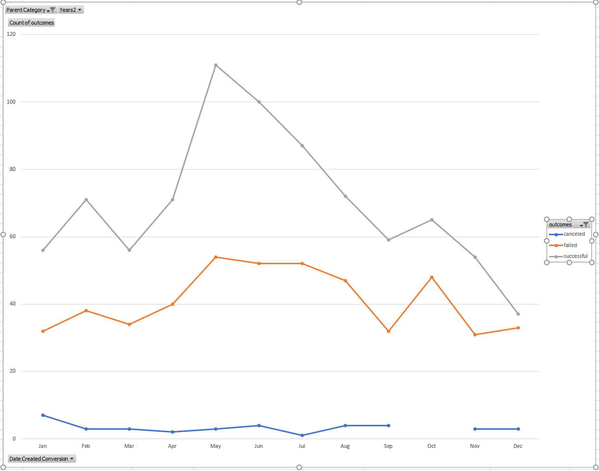

# Crowdfunding Analysis Using Excel

## Overview of Project- Analyse Large amount of data with a diverse set of desired results based on requirements.

### Purpose- This Project is to use data analysis on a large set of data and familiarize with the functionality of Excel and its versatility with sorting and maniplating data. In this case with the Kickstarter projects.

## Analysis (thought process) and Challenges
 1. The analysis was fairly straighforward
--
 1. My biggest challenge was learning what I did not know about excel
 2. I still do not know 90% of what I think I need to about excel

### Analysis of Outcomes Based on Launch Date
#### Here is the link to the outcome graph
/Theater_Outcomes_vs_Launch.png.PNG

### Analysis of Outcomes Based on Goals
#### Here is the link to the Outcomes Based on Goals graph
#### /Outcomes_vs_Goals.PNGG

### Challenges and Difficulties Encountered
#### I found that I need to up my game A LOT.

## Results

- What are two conclusions you can draw about the Outcomes based on Launch Date?
--The Month of May is a good time to start a project
--December not so much

- What can you conclude about the Outcomes based on Goals?
--The highest success % rate is for projects that are <4999
--The highest failure % rate is for projects that are in the 25000 to 30000 range

- What are some limitations of this dataset?
--Financial information on the donors
--Social circles tend to donate to certain causes, this could help target markets for donations and funding

- What are some other possible tables and/or graphs that we could create?
-- %Goal by outcomes/country
-- %Goal by category/subcategory

